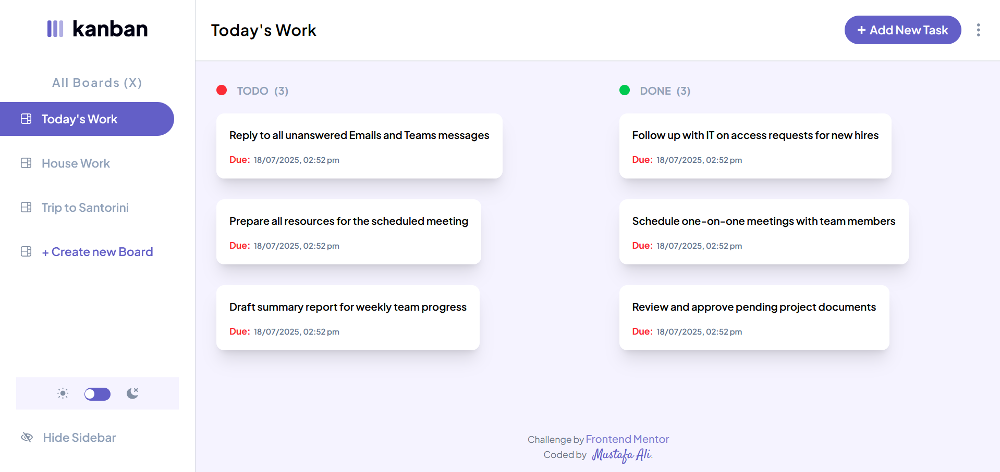

# Kanban To-Do Web App

A feature-rich Kanban-style task management app built with modern frontend tools:

- **Vite** for lightning-fast development
- **React + TypeScript** for robust UI and type safety
- **Tailwind CSS** for a utility-first styling approach
- **Zustand** (v5) for lightweight state management
- **Immer** and `useImmer` for immutable state updates
- **Zustand middleware**: `immer`and `devtools`
- **Flatpickr** for elegant date picking

---

## Live Site on Vercel:

[vercel](https://kanban-mustafa-alie-mustafa-alis-projects-60b90124.vercel.app/)

---

## 📸 Preview



---

## ⚙️ Tech Stack

- **Framework**: Vite + React
- **Language**: TypeScript
- **Styling**: Tailwind CSS v4.1
- **Date Picker**: Flatpickr
- **State Management**: Zustand v5 with Immer, Devtools, and Persist middlewares

---

## 🔧 Features

- 🧠 **Global state** with Zustand (slices for layout, boards, tasks, etc.)
- 📝 Create, edit, delete boards and tasks
- 📊 Organize tasks into boards and columns
- 📆 Choose due dates via Flatpickr
- 🎨 Responsive UI styled with Tailwind
- 🧩 Uses Immer for intuitive immutable updates
- 🧪 Devtools enabled during development for easier debugging

---

## 🚀 Getting Started

```bash
# Clone the repo
git clone https://github.com/your-username/kanban-app.git
cd kanban-app

# Install dependencies
npm install

# Start dev server
npm run dev
```

---

## 📦 Build & Deploy

```bash
# Build for production
npm run build

# Preview production build
npm run preview
```

---

## 🧪 Devtools

Zustand devtools are included during development for debugging. You can disable or remove them before deploying to production if needed.

---

## 🙌 Acknowledgments

Inspired by the Kanban-style task boards from tools like Trello and Frontend Mentor challenges.

---

Happy Coding! 🎉
